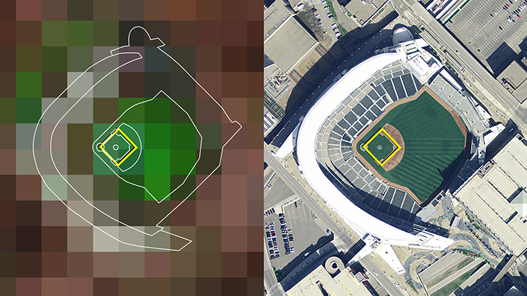
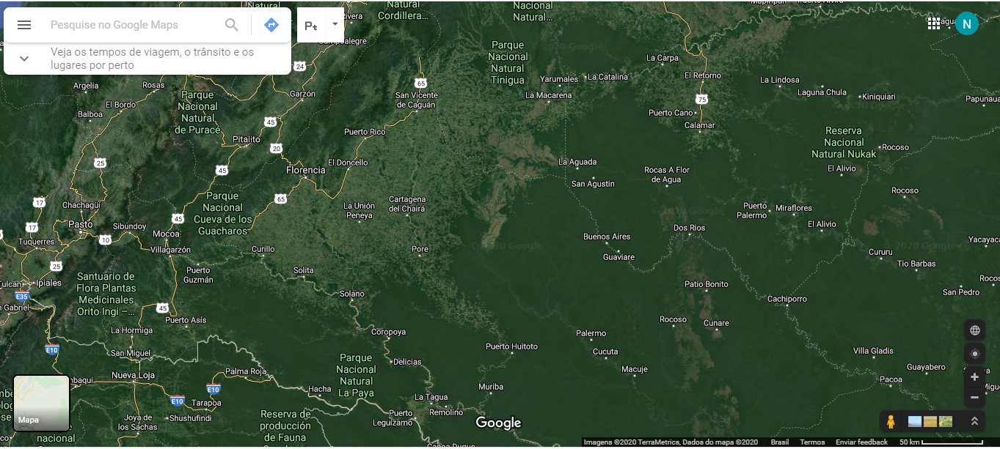
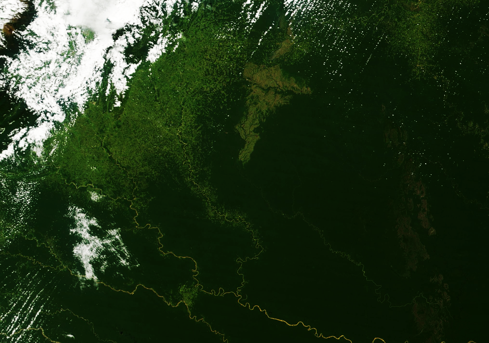
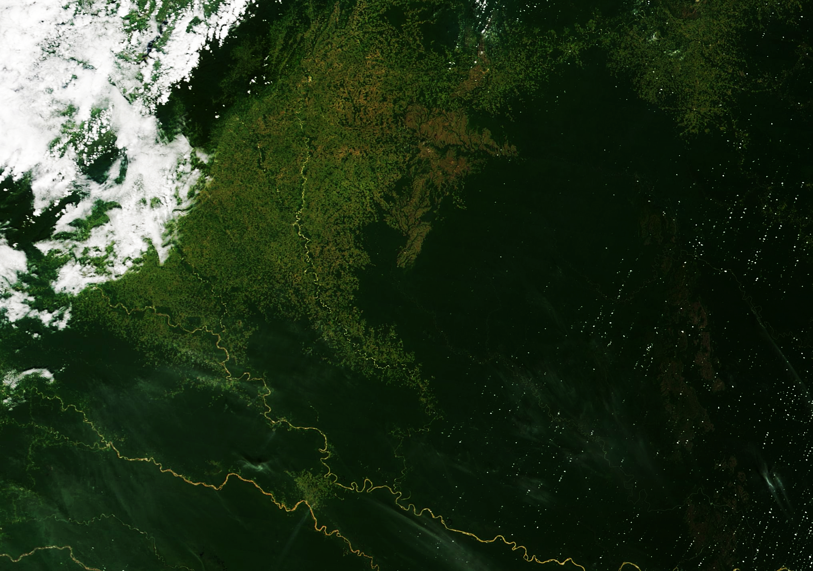
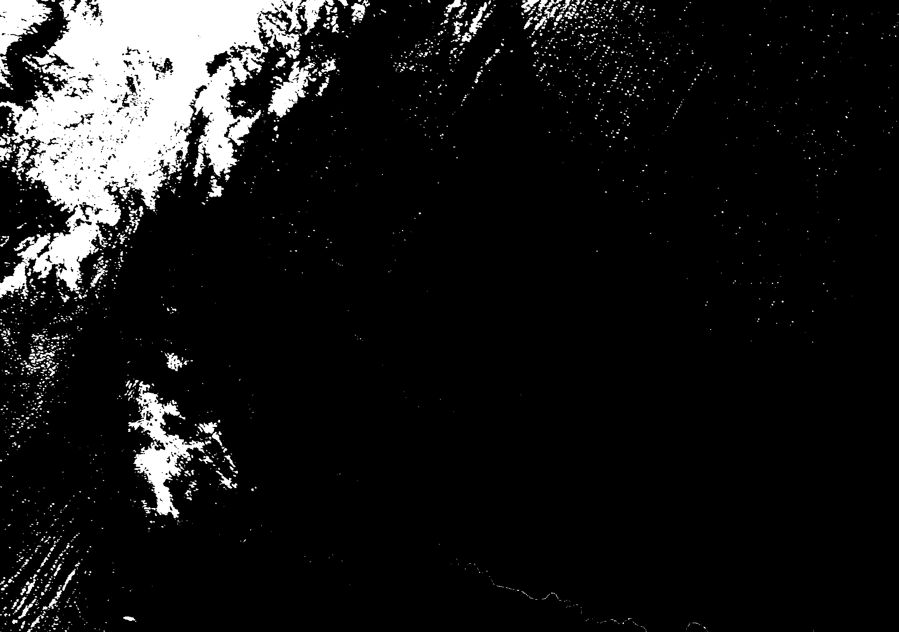
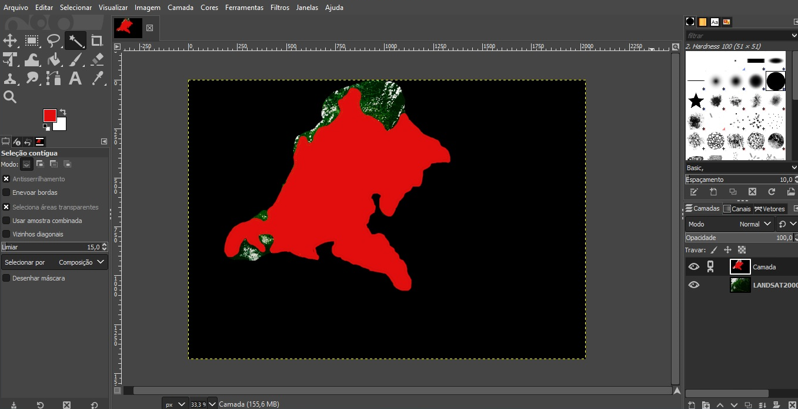
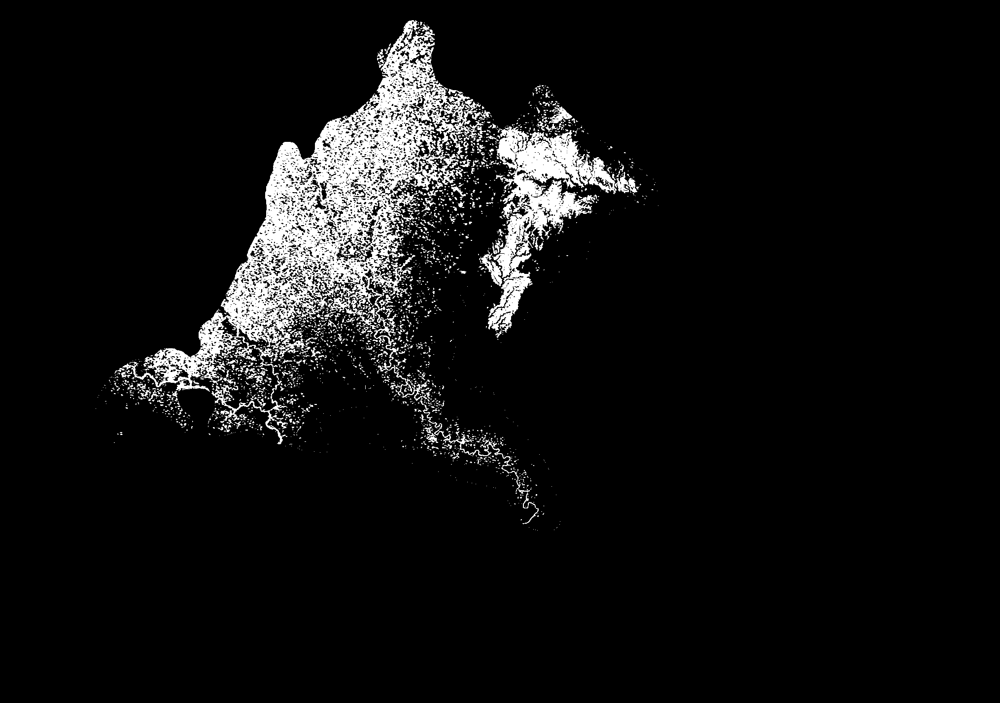
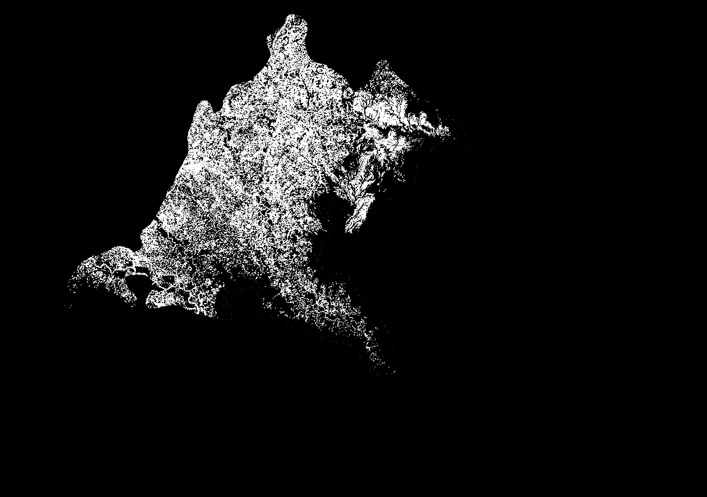
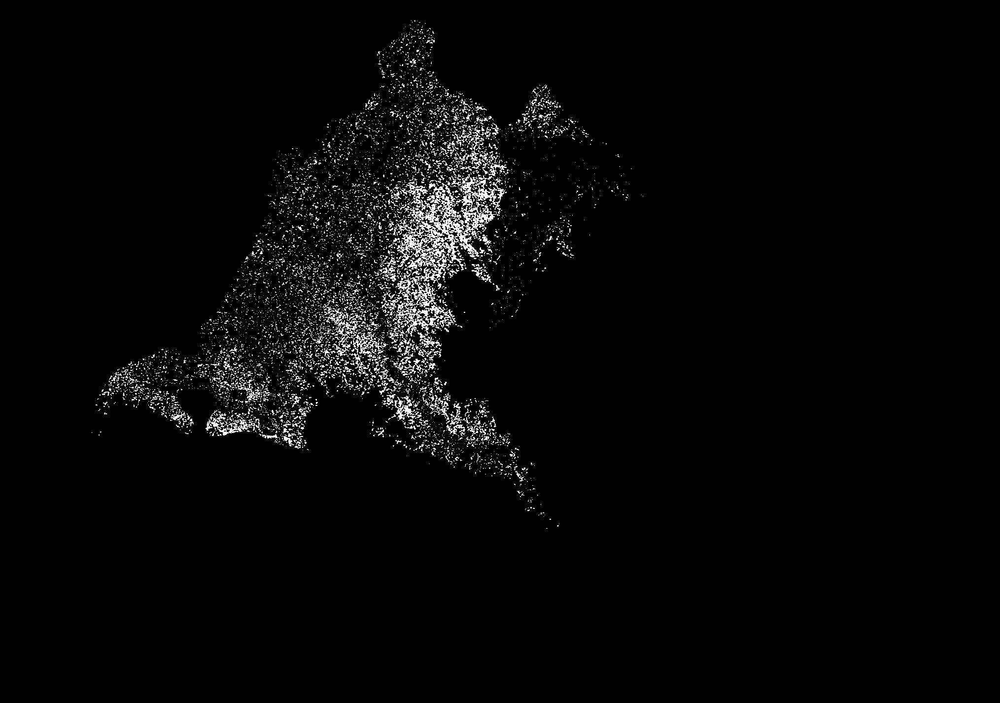

# Final Project
## Title: Deforestation rates in the Amazon forest through satellite images
 
 This is a final project, for the Image Enhancement discipline, addressing the deforestation of the Amazon rainforest as a theme.
 
 **Student:**
 
 - Normando de Campos Amazonas Filho, NUSP: 11561949
 - Robson Pessoa, NUSP: 8632563
 
 **Title: Deforestation rates in the Amazon forest through satellite images**

Abstract: This project aims to identify and quantify the deforestation of the Amazon rainforest using as an example 2 comparative images (2000 and 2017) from a NASA LANDSAT satellite, where each pixel represents an area of 0.09 ha or 900m². This type of quantification where pixels are related to measurements is known as photogrammetry. The project has 3 important phases: the first is pre-processing where the aim is to improve the image (eliminating noise through filters). The second phase is to define regions of interest and extract them (segmentation). Finally, the third phase consists of generating a statistic comparing the established metrics.

**Main objective**

 This project seeks to understand the methodology adopted by INPE in calculating the rate of deforestation in the Amazon, in the so-called PRODES program (Program for Calculating Deforestation in the Amazon). This methodology was originally developed by the INPE team during the period 1988-2002 to be used in the context of the PRODES Analógico project. In this period, the interpretation of the images was done by visual interpretation of images printed on photographic paper.
Since 2003, INPE has adopted the computer-assisted interpretation process for calculating the deforestation rate in the Amazon, called the PRODES Digital program to distinguish it from the previous process.
 It should be noted that the procedures used by INPE in the period 1988-2002 were never properly documented by those responsible at the time. The 2006 methodology document is the first available description of the fee calculation procedures. It is also worth remembering that INPE started to publish digital maps that describe deforestation in the Amazon only as of 2003. Until then, this information was restricted and not accessible even to other government agencies, which had serious consequences, as it reduced a lot the capacity of the government and society to combat deforestation.
The project will try to understand which are the applied methods that allow an identification and quantification of regions that are extremely vast and difficult to access. 

**Description of Input Images**

 In this project are going to be used two comparative 30 – meter images, of the year 2000 and 2017, obtained from a NASA LANDSAT satellite, that have a dimension of 2029 x 1427 pixels,  where each pixel represents an area of 0.09 ha or 900m² (almost a baseball field).

_Image 1 - representation of the size oh the pixel._

 The chosen images from NASA were acquired on the website https://earthobservatory.nasa.gov/images/145888/making-sense-of-amazon-deforestation-patterns and it represents a fragment of the Caguán River located in Colombia.

_Image 2 - forest area image acquired in 2000._

_Image 3 - forest area image acquired in 2017._

The real area is located at the coordinates 1.131384, -74.546652, and is full of cities that are constantly expanding, which explains the deforestation of the area.

_Image 4 - image from Google Maps in 2020._

**Description of steps to reach the objective**

 This type of quantification where pixels are related to measurements is known as photogrammetry. 
 The project has 3 important phases: the first is pre-processing where the aim is to improve the image 
 (eliminating noise through filters). The second phase is to define regions of interest and extract them (segmentation). 
 Finally, the third phase consists of quantify a statistic comparing the established metrics.
 
 In the phase of pre-processing the main goal is to increase the delimitation of some interested areas in the image 
 to be used in the phase of segmentation. 
 The steps used to achieve that are:
 1. Increase the contrast of the image by applying an Adaptive Histogram Equalization Filter in each color channel.
   This method redistribute the color intensity values of the image by applying a function in different regions of the 
   image in order to saturate each one of them with different coefficients.
    
    _Image 5 - forest area image acquired in 2000 with higher contrast._
    
    
    _Image 6 - forest area image acquired in 2017 with higher contrast._
    
 2. Increase the sharpness of the image by applying the Laplacian Filter in each color channel. 
 This method highlight regions of rapid intensity change, improving the visibility of edges.
    
    _Image 7 - forest area image acquired in 2000 with higher sharpness._
    
    _Image 8 - forest area image acquired in 2017 with higher sharpness._
 
 To the segmentation phase, the aim is to delimit areas such as clouds, rivers, forest and deforested areas to be used 
 in the last phase of comparison.
 To do that, some color ranges are going to be used to describe a specific area. The proposal is to apply the Otsu method 
 to find the global optimum threshold and apply it for each range defined. The specified ranges are for:
  * 100% Forest Area.
  * 90% Forest Area.
  * 80% Forest Area.
  * 70% Forest Area.
  * 60% Forest Area.
  * 50% Forest Area.
  * 40% Forest Area.
  * 30% Forest Area.
  * 20% Forest Area.
  * 10% Forest Area.
  * 0% Forest Area.
 
 For each range, the segmentation method is applied in the two images. The results are subtracted to find the 
 difference of forest area between the two acquisitions pixel by pixel. The higher the value in the resulted image, 
 the bigger is the deforestation.
 
 The output image is a heat map of deforestation.
 
**Experimentation**

For experimentation with the Otsu method, the original image was used. The method works with gray scale, generating a threshold within the histogram and dividing everything into two very distinct layers.
In a first experiment, the ineffectiveness of the method in the presence of clouds was noted, since it assumed the highest value pixels as one of the most expressive objects and darkened everything else.

  _Image 9 - Otsu method in an image with clouds._

The solution to this was to cut out an area of interest, taking care not to include significant amounts of clouds. This process was performed in GIMP, which created an alternative layer and hand-cut a mask of the region of interest within the image of the year 2017, excluding the clouds from the new image.
After that the same mask was applied to the image of the year 2000, which had a new cutout by hand to exclude the clouds that were still inside the mask.

  _Image 10 - image mask._

With the new image, it was possible to generate an Otsu filter and this time retain significant pixel disparity information with both the 2000 image and the 2017 image.

  _Image 11 - Otsu method in the ROI of the year 2000._

  _Image 12 - Otsu method in the ROI of the year 2017._

A subtraction of the Otsu output of 2017 was performed with the Otsu output of 2000 and in this way a visual difference was reached from what would be the deforestation increase from 2000 until 2017 exclusively.

  _Image 13 - Subtraction of the both images (2017-2000)._
 
 
 Final project for **[SCC0251 - Image Processing](https://uspdigital.usp.br/jupiterweb/jupDisciplina?sgldis=SCC0251)** @ ICMC/USP.
 
 
